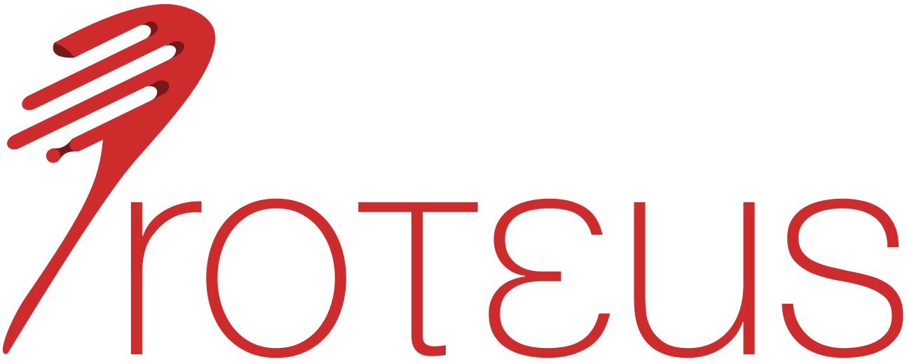

Proteus: Just-In-Time Executor
================
The executor of Pelago, a prototype in situ DBMS employing Just-In-Time operators.

For more information on the project checkout the website [proteusdb.com/](https://proteusdb.com/). Further documentation on building, running and contributing can be found in the [docs folder](docs/README.md).


Update include paths in Clion after LLVM update
========

Clion lazily updates the include paths during remote deployment, use the resync with remote hosts to force a refresh: https://www.jetbrains.com/help/clion/remote-projects-support.html#resync


Editing CMake configurations with user-specific settings
========
Sometimes you want to invoke `cmake` with different flags or have multiple profiles.
CMake allows that through a `CMakeUserPresets.json` file that you can add locally with user-specific settings.

For example, if you want to produce verbose makefiles or use a pre-configured CLion/Gateway configuration, you can add in the project root the following `CMakeUserPresets.json` file:

```json
{
  "version": 3,
  "configurePresets": [
    {
      "name": "Proteus - User",
      "inherits": "Proteus",
      "cacheVariables": {
        "CMAKE_VERBOSE_MAKEFILE": "ON"
      },
      "vendor": {
        "jetbrains.com/clion": {
          "toolchain": "diascld00"
        }
      }
    }
  ],
  "buildPresets": [
    {
      "name": "Proteus - User - Build",
      "inherits": "Proteus Build",
      "configurePreset": "Proteus - User"
    }
  ]
}

```
You should *NOT* commit this file, to avoid conflicts with other users (it's already in our gitignore).
Furthermore, you should not depend on any user-specific settings to run/compile Proteus and any time you think something is broken, you should first verify that any user-specific settings in that file do not cause the issue.
