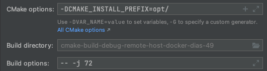

# Building
## Building With docker (recommended)
We provide a docker container, `proteusdb/proteus-dev`, for our toolchain which has the required dependencies to configure and build proteus.
### Requirements:
Host system ubuntu 18.04 (we have tested extensively on 18.04, 20.04/22.04 should work, but it is not guaranteed) with docker + [nvidia-docker](https://docs.nvidia.com/datacenter/cloud-native/container-toolkit/install-guide.html#installing-on-ubuntu-and-debian) installed.

### Building with CLion and docker
**Note** these instructions are derived from [the jet brains blog post on using a docker environment via ssh](https://blog.jetbrains.com/clion/2020/01/using-docker-with-clion/)
- clone the repo and open it in clion.
- Start the dev container:
```sh
docker run -d --gpus all --security-opt  seccomp={path_to_repo_root}/tools/docker/proteus-build/seccomp.json --cap-add=SYS_NICE --cap-add=IPC_LOCK --cap-add sys_ptrace -p127.0.0.1:2222:22 proteusdb/proteus-dev:cuda11.3-llvm14.0.0
```
**Note** it is not recommended to expose this container to a public network
- add a new toolchain in clion with username `user`,  password `password`, host `localhost` and port `2222`
- add a new clion CMake profile using this toolchain. Set the CMake and build options for the install directory and the build parallelism e.g.
- You can now use clion remote development to build proteus like any other project


### Building with the command line in docker
- clone this repo to a convenient location e.g.
  ```sh
  user@server01:~$ git clone git@github.com:epfl-dias/proteus.git
  ```
- Start the container and mount the source directory into the container:
  ```sh
  user@server01:~$ docker run -it --gpus all -e LOCAL_UID=$(id -u $USER) -e LOCAL_GID=$(id -g $USER) --mount type=bind,source="$(pwd)"/proteus,target=/proteus --security-opt seccomp="$(pwd)"/proteus/tools/docker/proteus-build/seccomp.json --cap-add=SYS_NICE --cap-add=IPC_LOCK proteusdb/proteus-dev:cuda11.3-llvm14.0.0 /bin/bash
  ```
  - *Note* Like with most docker images, avoid using the `latest` tag, newer versions of the container may have  versions of LLVM and cuda which are incompatible with this commit.
  - *Note* In order to run benchmarks prepared datasets need to also be mounted into the docker container. In the case of SSB100(0) with `--mount type=bind,source=/path/to/ssb100,target=/proteus/tests/inputs/ssb100`
  - *Note* If you are using docker 19.03, use the alternative seccomp file: `seccomp-19-03.json`
  
- Setup docker environment for proper file permissions on mounted directory
  ```sh
  root@8eae36dca703:/# /proteus/tools/docker/utilities/enter-docker-env.sh
  ```
  This script will set the UID/GID inside the docker container to match the UID/GID of the host so that you will have permissions to write to the bind-mounted source directory.

- Configure CMake:
  ```sh
  user@8eae36dca703:/# cmake -DCMAKE_BUILD_TYPE=Debug -DCMAKE_INSTALL_PREFIX=/proteus/opt/ -S /proteus -B /proteus/cmake-build-debug
  ```
  - *Note* `Debug` is the only supported build type, it is not a traditional debug build, it is still an optimised build.
  - *Note* the first time doing this will take a couple of minutes, it will appear to hang after
    ```sh
    -- Found Python: /usr/bin/python3.6 (found version "3.6.9") found components: Interpreter
    ```
but it will eventually continue
- Build proteus
  ```sh
  user@8eae36dca703:/proteus  cmake --build /proteus/cmake-build-debug --target install -- -j 72
  ```
*Note* set -j to the available number of cores on your system for build parallelism
*Note* We use install as the preferred target to ensure all internal dependencies are up-to-date after any source modifications. Running binaries from their build location may lead to unexpected results. 
Binaries can then be run from the install location (`/proteus/opt/pelago`), all binaries should be run from this folder as they depend on the path to find datasets.


## Building Docker
### Requirements:
- Ubuntu 18.04 (20.04/22.04 *should* work but are not tested in ci).
- Dependencies: CMake fetches and builds most dependencies, however there are some which must be installed at the system level. 
See the list in `docker/pelago-build/requirements.txt`, in addition to this list we also require LLVM and CMake. For the current minimum CMake version see the top of the root `CMakeLists.txt`. The current required LLVM version can be found in `cmake/modules/proteus-prolog.cmake`

# Dependency management
Dependencies are broadly broken up into 1) system dependencies and 2) dependencies built via CMake.
However, there are also some dependencies where it is sometimes preferable to build them ourselves, but outside of CMake.
In particular, LLVM and CMake, since both are required to build dependencies and Proteus in CMake, and it is necessary to have fine-grained control over the LLVM and CMake versions. i.e distro repos may not always have the appropriate versions available.
In general, we try to minimize system dependencies and where possible prefer to build dependencies ourselves in CMake. 

## LLVM & CMake
You can build Proteus with an LLVM/CMake you compiled yourself, or a system install of LLVM/CMake from distro repos if it is the appropriate version.
If you are using a self compiled LLVM/CMake you need to update your `PATH` and `LD_LIBRARY_PATH` environment variable before configuring CMake to build Proteus. e.g
```sh
export LD_LIBRARY_PATH='PATH_TO_LLVM_INSTALL/lib:$LD_LIBRARY_PATH'
export PATH="PATH_TO_LLVM_INSTALL/bin:PATH_TO_CMAKE_INSTALL/bin:$PATH"
```
Because Proteus uses LLVM for runtime code generation, `LD_LIBRARY_PATH` must also be set so that Proteus can find the LLVM shared libraries can be found at runtime.
In our CLion configs you may find reference to `/scratch/pelago/llvm-14/opt/`. This is the path of our internal toolchain, where we install both LLVM and CMake. 
